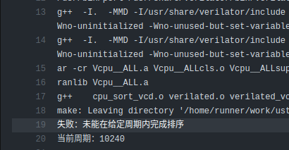

# USTC-CODH-LAB6 实验

USTC CODH 课程的综合实验 lab6

使用实体板：xc7a100tcsg324-1

本实验为小组合作实验，组员主页：

- <https://github.com/liuly0322>
- <https://github.com/start-shine>

## rv32i 指令集

实现了所有的 rv32i 指令

- add, sub, and, or, sll, sra, srl, xor, slt, sltu
- addi, andi, ori, slli, srai, srli, xori, slti, sltiu
- auipc, lui
- lw, sw, lb, lbu, lh, lhu, sb, sh
- beq, bne, blt, bge, bltu, bgeu
- jal, jalr

共计 37 条

## rv32ic 压缩指令集

- c.nop
- c.add, c.addi, c.addi16sp, c.addi4spn, c.and, c.andi, c.slli, c.srai, c.srli, c.sub, c.mv, c.or, c.xor
- c.j, c.jal, c.jr, c.jalr, c.beqz, c.bnez
- c.li, c.lui, c.lw, c.lwsp, c.sw, c.swsp

共计 26 条

## 冲突处理及分支预测

此部分主要是 CPU 的性能相关

较为完善地降低了 CPU 的 CPI，当且仅当 load 指令与后面指令存在数据相关时会产生气泡

分支（跳转）失败实际上是很影响流水线效率的：需要 flush IF/ID 和 ID/EX，损失两个周期

因此这里采用了 2-level adaptive training 的动态分支预测策略，具体性能评估见 report.md

整体性能上，当前 cpu 可以运行在约 85MHz 下

## VGA 应用程序

作为示例，本项目运行了三个应用程序，生命游戏，井字棋和贪吃蛇。具体说明和演示视频见 `life_game`, `tic_tac_toe`, `snake` 文件夹

我们希望 VGA 驱动模块作为主要的输出模块能够在逻辑上独立于其他 Verilog 模块（这样便于修改），仅与汇编程序相配套，因此这里采用了与主存共享内存的方式来给 VGA 提供数据，事实证明这极大提高了移植的效率

## 为什么不做...?

- 中断：
  - 最初引入硬件中断，只是出于性能上的考量。如果电脑系统没有中断，则处理器与外部设备通信时，它必须在向该设备发出指令后进行忙等待（Busy waiting），反复轮询该设备是否完成了动作并返回结果。这就造成了大量处理器周期被浪费。引入中断以后，当处理器发出设备请求后就可以立即返回以处理其他任务，而当设备完成动作后，发送中断信号给处理器，后者就可以再回过头获取处理结果。这样，在设备进行处理的周期内，处理器可以执行其他一些有意义的工作，而只付出一些很小的切换所引发的时间代价
  - 目前的 toy cpu 只有一个主程序在运行，轮询并不会造成时间的浪费
- cache：
  - 暂时需要的存储空间不大

~~其实这也是个 todo list，哪个做了就可以把哪个移出去了~~

## CI/CD 及自动化测试

### 持续集成

本项目支持持续集成 (Continuous Integration)，通过 `test.py` 实现，每次对主分支的 push 会自动运行功能测试，如果有错误会显示

以下是示例：

|  |  |
| :---------------------------------------: | :--------------------------------------------: |
|            Push 后自动运行测试            |                具体错误信息提示                |

### 本地测试

本项目来源于模板：<https://github.com/liuly0322/ustc-cod-verilator>

上面的模板链接中有本项目本地测试工具 `judge.py` 的具体说明及使用方法。本项目在模板的基础上另行增添了几个测试用例

部分测试样例对应的汇编代码见本目录下的 bypass.dump， ri.dump 和 compress.dump

本项目当前总测试样例数为 181 个

## 致谢

- 本项目得到了中国科学技术大学 Vlab 实验平台的帮助与支持。
- 自动化测试参考 <https://github.com/cs3001h/cs3001h.tests> 以及官方测试 <https://github.com/riscv-software-src/riscv-tests>
