&nbsp;

<div style="text-align:center;font-size:2.5em;font-weight:bold">中国科学技术大学计算机学院</div>

&nbsp;

<div style="text-align:center;font-size:2.5em;font-weight:bold">《计算机组成原理实验报告》</div>

&nbsp;

&nbsp;

&nbsp;

&nbsp;

&nbsp;


&nbsp;

&nbsp;

&nbsp;

&nbsp;

<div style="display:flex;justify-content:center;font-size:1.8em;line-height:2em">
<div>
<p style="padding-bottom:5px">实验题目：</p>
<p style="padding-bottom:5px">组员列表：</p>
<p style="padding-bottom:5px">&#x3000;</p>
<p style="padding-bottom:5px">完成时间：</p>
</div>
<div style="text-align: center;">
<p style="border-bottom: 1px solid; padding:0px 1em 4px">综合设计</p>
<p style="border-bottom: 1px solid; padding:0px 1em 4px">刘良宇 <span style="font-size:0.9em">PB20000180</span></p>
<p style="border-bottom: 1px solid; padding:0px 1em 4px">王铖潇 <span style="font-size:0.9em">PB20000072</span></p>
<p style="border-bottom: 1px solid; padding:0px 1em 4px">2022. 5. 19</p>
</div>
</div>

<div style="page-break-after:always"></div>

## 实验成果简介

本小组此次实验中在流水线 CPU 的基础上，增加拓展了以下内容：

- RV32I 指令集补全（37 条），RV32IC 压缩指令拓展（26 条）

- 采用两级动态 Branch History Table 分支预测

- 支持 L1d Cache，并调整存储结构

  - 对于 0x00000000 至 0x000003ff，作为常用内存区域，与 VGA 共享内存

    （这一部分相当于始终不会被换出的 cache）
    
  - 0x0000ff00 至 0x0000ffff 是 MMIO 区域
    
  - 其余部分使用 L1d cache 连接主存，总共使用 BRAM 16KB（16 千字节）

- 提供可以实际运行的生命游戏，井字棋和贪吃蛇程序
  - 使用 C 语言编写程序，探索了交叉编译流程，增进了对计算机抽象层级的理解
  - 增添了对 VGA 屏幕外设的使用，使得程序更具有表现力
  - 考虑了一般性的外设拓展方法
    - 一般地，对数据寄存器封装，使用 MMIO
    - 特别地，由于 VGA 模块数据需求量较大，采取了共享内存的方式

项目仓库：<https://github.com/liuly0322/ustc-codh-lab6>

## 实验环境

- Vivado 2019.1
- Verilator 4.220

## 指令集扩充

实现所有 RV32I 指令（37 条）：

- add, sub, and, or, sll, sra, srl, xor, slt, sltu
- addi, andi, ori, slli, srai, srli, xori, slti, sltiu
- auipc, lui
- lw, sw, lb, lbu, lh, lhu, sb, sh
- beq, bne, blt, bge, bltu, bgeu
- jal, jalr

实现所有 RV32IC 压缩指令（26 条）：

- c.nop
- c.add, c.addi, c.addi16sp, c.addi4spn, c.and, c.andi, c.slli, c.srai, c.srli, c.sub, c.mv, c.or, c.xor
- c.j, c.jal, c.jr, c.jalr, c.beqz, c.bnez
- c.li, c.lui, c.lw, c.lwsp, c.sw, c.swsp

RV32IC 是 RV32I 对应的压缩指令集，允许极大节省编译出程序的空间

### 原理介绍

整体数据通路参考：


下面具体介绍一些涉及到的修改：

- ALU 和 control 模块修改

  对于置位指令，lui 指令，可以和算数逻辑指令统一，让写回寄存器的数据来源取 ALU 输出，通过控制 ALU 操作数让 ALU 计算出正确的结果

  ```verilog
  module alu #(
          parameter AW = 5,
          parameter DW = 32)
      (input [DW - 1: 0] a,
       input [DW - 1: 0] b,       // 两操作数
       input [3: 0] s,            // 功能选择
       output reg [DW - 1: 0] y,  // 运算结果
       output [2: 0] f);          // 标志

      // 大小判断
      wire [DW - 1: 0] a_minus_b = a - b;
      wire a_s = a[DW - 1];
      wire b_s = b[DW - 1];
      wire y_s = a_minus_b[DW - 1];

      // 移位
      wire [AW - 1: 0] b_shift = b[AW - 1: 0];

      // 大小比较信号
      wire less_signed   = (a_s & ~b_s) | (a_s & y_s) | (~b_s & y_s);
      wire less_unsigned = (~a_s & b_s) | (~a_s & y_s) | (b_s & y_s);
      assign f = {less_unsigned, less_signed, (a_minus_b == 0)};

      always @(*) begin
          case (s)
              4'b0001:
                  y = a_minus_b;
              4'b0010:
                  y = a & b;
              4'b0011:
                  y = a | b;
              4'b0100:
                  y = a ^ b;
              4'b0101:
                  y = a >> b_shift;
              4'b0110:
                  y = a << b_shift;
              4'b0111:
                  y = ($signed(a)) >>> b_shift;       // signed
              4'b1000:
                  y = {31'b0, f[1]};
              4'b1001:
                  y = {31'b0, f[2]};
              4'b1010:
                  y = b;
              default:
                  y = a + b;
          endcase
      end

  endmodule
  ```

  可以看到，`4'b1000` 和 `4'b1001` 用于置位指令，`4'b1010` 用于 lui

  这样修改最大程度保持了数据通路的简洁性

  控制模块根据指令 funct3 位的值生成 ctrl_alu_op 信号

- 跳转判断和访存指令都需要用到 funct3 位，可以直接流水段传递

  对于跳转指令，有：

  - funct3[2]，用于区分使用 alu 的相等判断还是大小比较
  - funct3[1]，用于区分如果比较大小，是否使用无符号数
  - funct3[0]，用于区分功能相反的跳转指令，例如 beq 和 bne

  因此 EX 段判断是否应该跳转的逻辑如下：

  ```verilog
  wire should_branch = funct3_ID[0] ^
  					(!funct3_ID[2]? alu_f[0]: ((funct3_ID[1] == 1)? alu_f[2]: alu_f[1]));
  ```

  对于访存指令，类似地区分 lw, sw, lb, lbu, lh, lhu, sb, sh 即可

- 新增压缩指令集

  出于时序考虑，IF 段只需要判断当前 ir 是不是压缩指令来决定下一条 pc

  ```verilog
  wire [31:0] pc_2 = pc + 32'h2;
  wire [31:0] pc_4 = pc + 32'h4;
  wire is_compressed = pc[1] || (ir[1:0] != 2'b11);
  
  always @(posedge clk) begin
      ...... 	// 其他跳转逻辑
      else if (is_compressed)
          pc <= pc_2;
      else
          pc <= pc_4;
  end
  ```

  ID 段增加压缩指令到完整指令的译码：

  ```verilog
  wire is_compressed = pc_IF[1] || (ir_IF[1:0] != 2'b11);
  wire [15:0] ir_compressed = pc_IF[1]? ir_IF[31:16]: ir_IF[15:0];
  wire [31:0]	ir_dec;
  wire [31:0] ir = is_compressed? ir_dec: ir_IF;
  
  decompression u_decompression(
                    .IF_Instr_16 		( ir_compressed ),
                    .IF_Dec_32   		( ir_dec   		)
                );
  ```

  给出的 ir 作为实际译码的指令

  代码的解压缩模块参照每条压缩指令具体的说明即可，具体可以见本项目源码

### 新增指令测试

对新增的指令进行了较为充分的测试：

| 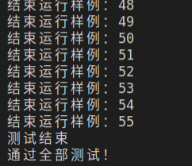 | 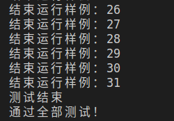 | 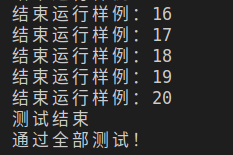 |
| :----------------------------------------------------------: | :----------------------------------------------------------: | :----------------------------------------------------------: |
|                     新增 R 型和 I 型指令                     |                         访存指令测试                         |                         压缩指令测试                         |

加上原有的 10 条指令的功能测试及 bypass 测试，总共使用了 181 个测试样例

测试原理示例：

| 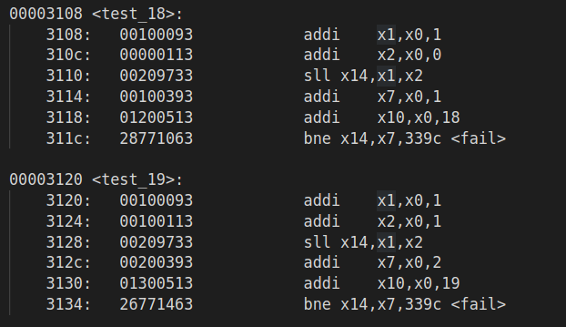 | 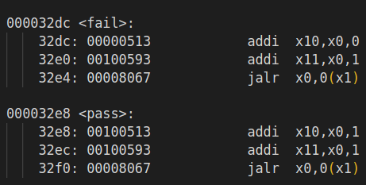 |
| :------------------------------------------------------------: | :------------------------------------------------------------: |
|                      具体案例用 x10 计数                       |                x11 表示结束，此时 x10 存储结果                 |

可以在仿真过程中，读 x11 和 x10 寄存器，来获取当前进行到了第几个测试样例，以及相应通过情况

对应仿真程序：

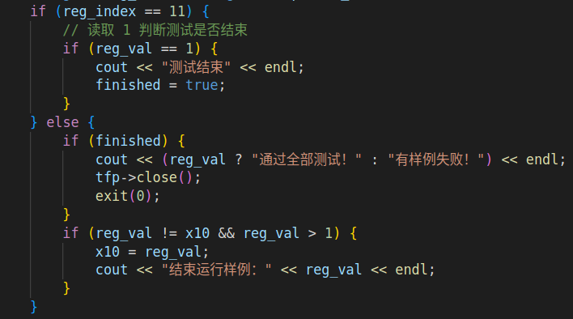

### Verilator 高级语言仿真

#### 简介

Verilator 是一款高性能的 Verilog/System Verilog 开源仿真工具。运用 Verilator package，我们可以将 Verilog 和 System Verilog HDL 语言设计编译转换成 C++ 或者 SystemC 模型，所以从这个意义上来说，Verilator 更应该被成为是一个编译器而不是一个传统意义上的仿真器。

通常情况下，Verilator 的工作流程如下所示：

1. 首先 Verilator 将读取特定的 HDL 文件并检查其代码，同时还可以选择支持检查覆盖率和 debug 波形的生成。然后将源文件编译成源代码级的 `C++`或`SystemC`模型。其输出的模型会以`.cpp`和`.h`文件存在。
2. 为了能够完成仿真，额外需要一个用户自行编写的 C++ wrapper，这个 wrapper 与传统的 Verilog Testbench 功能类似，主要是为了连接顶层模块，并给予相应的激励。
3. 在 C++ 编译器的工作下，所有的之前生成的文件（C++ wrapper 以及 Verilated Model）以及库文件（Verilator 提供的 runtime library 或者 SystemC 库文件）会被一同合并成一个可执行文件。
4. 执行生成的可执行文件，就可以开始实际的仿真，"simulation runtime"

#### 优势

- 最快的开源仿真器
- coverage test（覆盖测试）
  - 覆盖率，便于功能验证
  - 断言式的测试样例（灵活度高），对应 Verilog testbench 文件中的 function 或者 task，但编写起来更为容易，可以自动判断 CPU 功能正确与否

|  |  |
| -------------------------- | -------------------------- |

图：覆盖测试能解决的痛点

## 存储结构及一级数据 Cache

本实验更改了原先存储结构

- 对于 0x0000 至 0x3ffff，作为常用内存区域，与 VGA 共享内存

  这一部分相当于始终不会被换出的 cache

- 0xff00 至 0xffff 是 MMIO 区域

- 其余部分使用 L1d cache 连接主存，总共使用 BRAM 16KB（16 千字节）

这一部分可以通过组合逻辑对内存进行封装：

```verilog
reg  [31:0] mem_in;         // 写入数据寄存器的数据
wire [31:0] shared_out, cache_out;
wire [31:0] mem_out;        // 数据存储器读出的 32 位数据
reg  [31:0] mdr;            // 实际返回的数据

wire is_mmio = (a[31:8] == 24'h0000ff);    // 判断现在是主存还是 mmio
wire is_shared = (a[31:8] < 4);			   // 共享内存区域
wire is_cache  = ~is_shared & ~is_mmio;
assign spo     = is_mmio? io_din : mdr;
assign mem_out = is_shared? shared_out: cache_out;
```

本实验中的 Cache 采用直接映射 + 写回 + 写分配策略，具体状态机如下图所示：

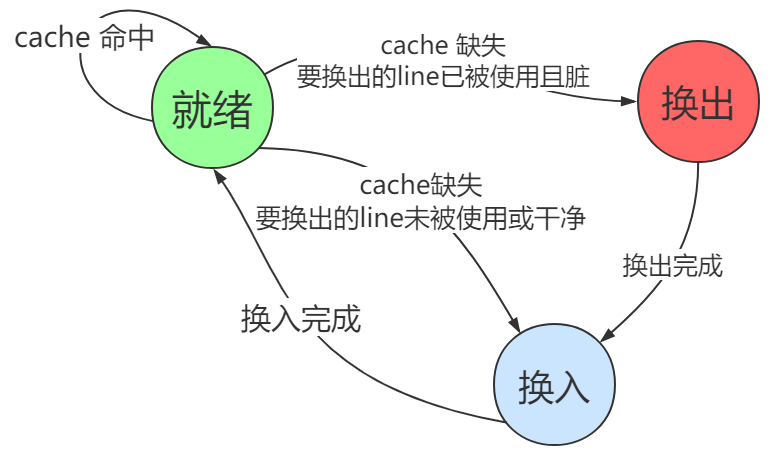

Cache 代码及可综合的 BRAM 代码参考：<https://github.com/Summer-Summer/ComputerArchitectureLab>

本实验 Cache 规格：

tag 6 位，index 3 位，偏移 5 位（3 位字偏移）

增添上 Cache 后，需要对原先的 hazard 处理模块也进行相应的更改

```verilog
module hazard(
        input rstn,
        input miss,
        input pc_change_EX,
        input load_use_hazard,
        output stall_IF,
        output stall_ID,
        output stall_EX,
        output flush_IF,
        output flush_ID
    );

    assign stall_IF = load_use_hazard | miss;
    assign stall_ID = miss;
    assign stall_EX = miss;
    assign flush_IF = rstn & pc_change_EX;
    assign flush_ID = rstn & (pc_change_EX | load_use_hazard);

endmodule
```

在 Cache Miss 时，需要阻塞流水线的各个段间寄存器

### 功能测试

为了验证我们 Cache 功能是否正常，这里编写了下述测试程序：

```c
// MMIO: 8'h0c: 数码管输出
int fib_ans[200] = {1, 1};

int fib(int x) {
    volatile unsigned* p = 0xff0c;
    if (fib_ans[x]) {
        return fib_ans[x];
    }
    int ret = fib(x-1) + fib(x-2);
    fib_ans[x] = ret;
    *p = ret;
    return ret;
}

int main() {
    fib(200);
}
```

依次计算斐波那契数列，并将结果输出到数码管

编译后得到：

```plaintext
3020:	ff010113          	addi	x2,x2,-16
......
3080:	01010113          	addi	x2,x2,16
3084:	00008067          	jalr	x0,0(x1)
```

可以看到，在递归计算时会用到栈指针 `sp` ，我们可以在计算过程中记录 `sp` 的最小值，仿真程序：

```cpp
int a = 1, b = 1, cnt = 0;
unsigned min_stack = 0xffffffff;

while (!Verilated::gotFinish() && main_time < sim_time) {
    // 循环读取内存值

    top->clk = !top->clk;
    top->eval();           // 仿真时间步进
    tfp->dump(main_time);  // 波形文件写入步进

    if (top->io_we) {
        int data = top->io_dout;
        if (data != b) {
            b = a + b;
            a = b - a;
            if (data != b) {
                cout << "失败：计算 fib 预期" << b << endl;
            }
            cnt++;
            cout << "预期" << b << " 实际" << data << endl;
            if (cnt > 190) {
                cout << "通过 fib 测试" << endl;
                cout << std::hex << "最小栈地址：" << min_stack << endl;
                tfp->close();
                exit(0);
            }
        }
    }

    if (top->chk_data < min_stack && main_time > 200) {
        min_stack = top->chk_data;
    }

    main_time++;
}
```

实际运行，得到结果：

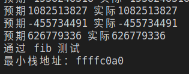

注意栈地址从 0xffffffff 到 0xffffc0a0，后 14 位从 `0x3fff` 遍历到 `0x00a0` ，几乎取遍了主存，可见在入栈出栈过程中 cache 进行了正确的换入换出

## 分支预测

### 意义

根据 Real Silicon 调研的数据，对于现代编译器编译后的程序，大概每隔 4.6 - 5.2 条指令就有一个分支（包括 call 和 direct jump 这种非条件分支），而在我们的五级流水线 CPU 上，每次挑战失败都需要损失两个周期，相当于执行了两条空指令，也就是说，在分支预测完全失败的情况下，不考虑其他相关引起的流水线停顿，我们的 CPU 的 CPI 已经高达 1.4，如果能够通过分支预测的方式将 CPI 降低到 1 左右，就可以提高约 40% 的性能，这是一个很诱人的数字。下面，将首先介绍几种分支预测策略的原理，再给出本组的实现

### 原理

主要分为静态分支预测和动态分支预测两类。

#### 静态分支预测

- 预测统一不跳转 / 统一跳转
- 取下一条指令统一发射地址较小的
- ......

#### 动态分支预测

- 缓存跳转后地址，并且用 1bit 记录上次分支的结果（BTB）

  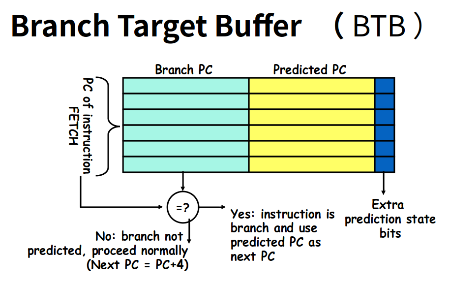

- 基于两位饱和计数器的分支预测 （BHT）

  这种方式是在 BTB 基础之上的改进，仍然需要 BTB 表，但是判断某分支是否跳转的依据不再是 1bit 的上一次记录，而是为每个分支指令映射到一个 2bit 的饱和计数器上，这样抗干扰能力更强（当之前连续跳转失败时，只有连续两次跳转成功才能使状态机变为预测跳转的状态，同理，如果连续跳转成功，那么需要连续两次跳转失败才能使状态机给出的预测变为不跳转）

  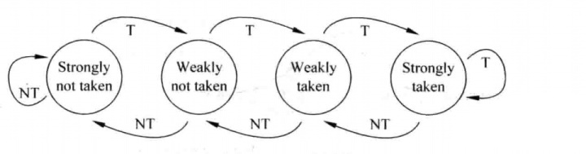

- 两级适应性训练 Two-Level Adaptive Training

  - 提出：Tse-Yu Yeh 和 Yale N. Patt

  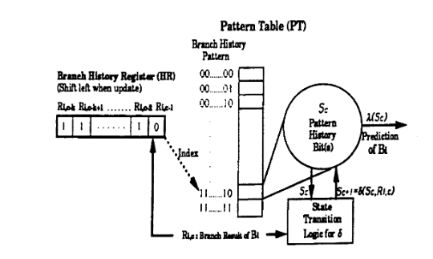

  在 BHT 的基础上改进，对于 **每个分支指令跳转的 pattern（模式）** 都映射到一个饱和计数器，进一步提高了分支预测准确性

  例如，如果一个分支指令跳转与否的历史记录分别是：

  `TNNNTNNNTNNNTNNN...`

  那么，分支预测器就会学习到，如果前几次的 pattern 是 `TNNN`，则下一次预测结果应该是 `T` ，因为 `TNNN` 这一模式对应的饱和计数器可以被学习为预测跳转的状态

  这对于以下的跳转模式十分有用：

  ```cpp
  for (int i = 0; i < n; i++) {
      if (i % 4) {
          // do something
      }
      // do something
  }
  ```

  `if` 指令跳转与否具有周期性，可以被记忆

值得注意的是，动态分支预测和静态分支预测并不是对立的，对于某条跳转指令，在第一次执行到时，动态分支预测可以采用静态预测的方法给出它跳转与否的初值，进一步提高预测准确性

### Verilog 实现

采用 BTB + 2-level adaptive training 的策略

对应流程图：

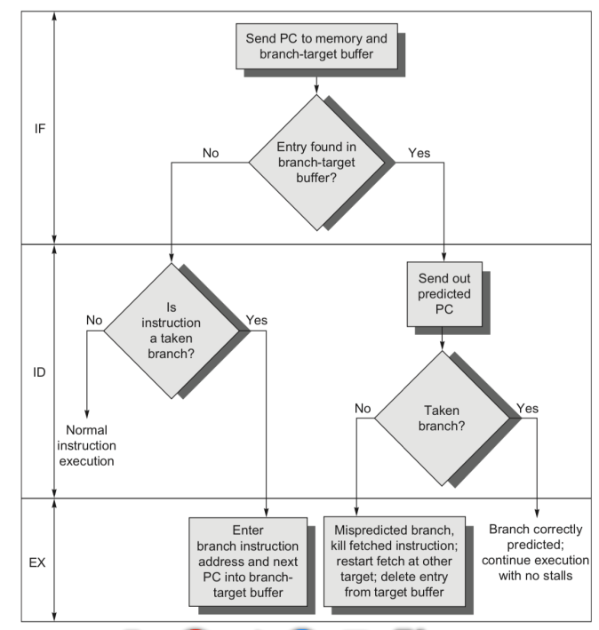

IF 段如果 PC 被预测跳转，下一个周期 PC 可以直接变为从 BTB 表中读出的跳转后 PC

同时，预测跳转与否的信息也会沿着流水线传递到 EX 段，EX 段根据实际跳转与否，可能需要将跳转后 PC 写入 BTB 表，并通知分支预测模块更新饱和计数器

整体模块如下所示：

```verilog
module branch_predict(
    input clk,
    input rstn,

    // EX 段记录结果
    input record_we,                // 是否记录分支历史
    input [9:2] record_pc,          // 记录的 pc
    input record_data,              // 记录是否跳转
    input [31:0] record_pc_result,  // 记录跳转后 pc
    // IF 段查询当前 pc
    input [9:1] chk_branch_pc,
    output predict,                 // 预测结果
    output [31:0] predict_pc        // 预测的 pc
);

reg [31:0] btb[0:255];      // BTB 表
reg [1:0]  record[0:255];   // (hash 后) 饱和计数器
reg [2:0]  history[0:31];   // (hash 后) 分支历史

wire [4: 0] chk_pc_hash    = chk_branch_pc[6:2];
wire [4: 0] record_pc_hash = record_pc[6:2];

// 预测 pc 只取 [9:2]，所以如果是高位压缩指令，直接不预测，返回 0
assign predict_pc = btb[chk_branch_pc[9:2]];
assign predict    = !chk_branch_pc[1] & rstn & (查询 record 应该跳转) & (predict_pc != 0);

always @(posedge clk) begin
    if (record_we) begin
        // 记录跳转后地址
        if (record_data) begin
            btb[record_pc] <= record_pc_result;
        end
        // 指令对应的跳转历史左移一位
        history[record_pc_hash] <= {history[record_pc_hash][1:0], record_data};
        // 下面判断是否需要更新饱和计数器
        ......
    end
end

endmodule

```

IF 段：

```verilog
always @(posedge clk) begin
    if (!rstn)
        pc <= 32'h3000;
    else if (pc_change_EX)
        pc <= pc_nxt_EX;
    else if (stall_IF)
        pc <= pc;
    else if (predict)       // 如果预测跳转
        pc <= predict_pc;
    else if (is_compressed)	// 不跳转或不预测跳转，按照正常逻辑更新 pc 即可
        pc <= pc_2;
    else
        pc <= pc_4;
end
```

EX 段：

```verilog
always @(*) begin
    if (ctrl_jal_ID | ctrl_jalr_ID)
        pc_nxt_EX = alu_out;
    else if (pc_branch_EX && predict_ID && !should_branch)   // 预测跳转但没有跳转
        pc_nxt_EX = pc_4_ID;
    else                                                     // 预测不跳转但跳转
        pc_nxt_EX = pc_ID + imm_ID;
end

assign record_we        = ctrl_branch_ID | jal_fail;
assign record_data      = ctrl_jal_ID? 1: should_branch;
assign record_pc_result = pc_nxt_EX;
```

这里我们也将 `jal` 跳转后地址存入 BTB 表，使得 `jal` 指令的跳转后地址也可以在 EX 段计算出

hazard 模块：

```verilog
......
assign flush_IF = rstn & pc_change_EX;
assign flush_ID = rstn & (pc_change_EX | load_use_hazard);
```

可以看到预测失败的代价是两个周期

下面分别挑选排序测试以及两个分支测试样例，对比采用不同的分支预测策略对性能的提高情况

### 排序测试

对内存中的 16 个数进行冒泡排序

```assembly
.data
...... # 这里有 16 个数

.text
addi	t1, zero, 0	    # sorted
addi	t0, zero, 17	# set n to array size + 1
addi 	a1, zero, 16	# const size (for print out
addi	a0, zero, 1	    # const 1
OUTER:
addi	t0, t0, -1
sub	t1, a0, t1
beqz	t1, END
addi	t2, zero, 0	 # i = 0
INNER:
addi	t2, t2, 1	 # init: i = 1
beq	t2, t0, OUTER
addi	t5, t2, -1
add	t5, t5, t5
add	t5, t5, t5
lw	t3, (t5)
add	t6, t2, t2
add	t6, t6, t6
lw	t4, (t6)
blt	t3, t4, INNER
beq	t3, t4, INNER	# 否则需要交换
sw	t3, (t6)
sw	t4, (t5)
addi	t1, zero, 0
j	INNER
END:
```

对几种分支预测方式进行测试：

|      |                             单周期                             |                           无分支预测                           |                          静态分支预测                          |                            BTB 预测                            |
| :--: | :------------------------------------------------------------: | :------------------------------------------------------------: | :------------------------------------------------------------: | :------------------------------------------------------------: |
| 周期 | 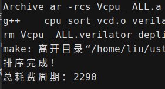 | 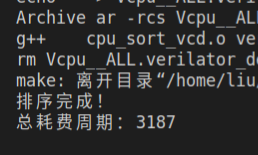 | 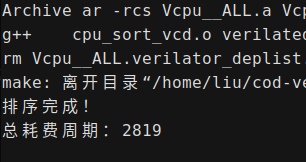 | 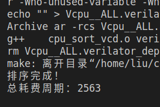 |
| CPI  |                               1                                |                             1.392                              |                             1.231                              |                             1.119                              |

对于排序比较的随机跳转，静态分支预测和 BTB 预测差距不大，BTB 主要提升了用于循环的跳转语句预测成功率

可以看到，BTB 预测和单周期的基准大约只差了 10%

这里由于排序结果导致的跳转比较随机，两级适应性 BHT 和 BTB 结果差距不大，不再列出

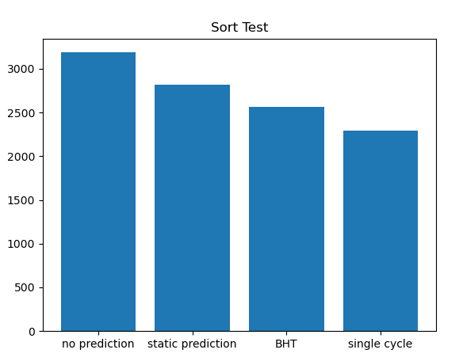

### 分支测试

这一组测试主要体现两级适应性 BHT 对分支历史 pattern 的学习能力

```c
for (int i = 0; i <= 1000; i++) {
    if (i % 4 == 0) {
        i+= 4;
    }
}
```

汇编：

```assembly
addi a0, zero, 1000
addi t0, zero, 0  # a
addi t1, zero, 0  # i

LOOP:
blt  a0, t1, FINISH
andi t2, t1, 3
bnez t2, CONT
addi t1  t1, 4
CONT:
addi t1, t1, 1
j    LOOP

FINISH:
addi t6, zero, 1
```

对几种分支预测方式进行测试：

|      |                             单周期                             |                           无分支预测                           |                              BHT                               |                            两级 BHT                            |
| :--: | :------------------------------------------------------------: | :------------------------------------------------------------: | :------------------------------------------------------------: | :------------------------------------------------------------: |
| 周期 | 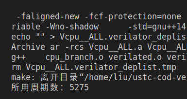 | 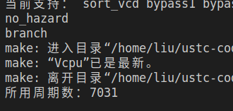 | 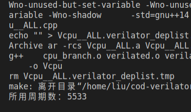 |  |
| CPI  |                               1                                |                             1.333                              |                             1.049                              |                             1.004                              |

两级 BHT 在这种情况下将 CPI 几乎降低到了 1，相比 BHT 进一步提高了准确率

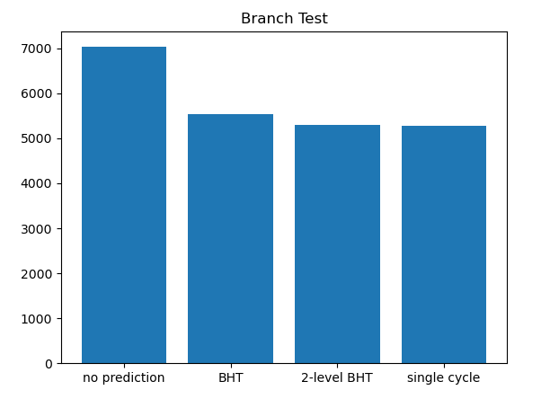

### 实际应用测试

这里实际搭载了 gcc 编译出的贪吃蛇程序（具体见下文），进行了分支预测性能和准确率的测试

在 ID 段统计总指令数：

```verilog
reg [31:0] instr_cnt;
always @(posedge clk) begin
    if (!flush_ID && ir_IF != 0)
        instr_cnt <= instr_cnt + 1;
end
```

在 EX 段统计跳转指令和 jal 的次数，并统计跳转失败的发生：

```verilog
reg [31:0] is_branch_cnt, fail_cnt, is_jal_cnt;
always @(posedge clk) begin
    if (ctrl_branch_ID)
        is_branch_cnt <= is_branch_cnt + 1;
    if (ctrl_jal_ID)
        is_jal_cnt <= is_jal_cnt + 1;
    if (pc_branch_EX || jal_fail)
        fail_cnt <= fail_cnt + 1;
end
```

因为 PDU 模块为了真实上板做了降频，取边沿等处理，对于模拟 `I/O` 交互不是很友好，如果对 top 模块整体仿真，往往需要连续仿真几毫秒甚至几十毫秒以上，仿真速度较慢，因此这里采用 Verilator 模拟 PDU 模块的功能

top 文件：

```verilog
module top_test(
        input clk,              // clk100mhz
        input rstn,             // cpu_resetn
        output [31:0] pc,
        // for simulate io
        output [7:0] io_addr,
        output io_rd,
        input [31:0] io_din
    );

    wire [31 : 0] io_dout;
    wire io_we;
    wire [31 : 0] chk_data;
    wire [31:0] vga_data;

    cpu CPU (.clk(clk), .rstn(rstn), .vga_addr(0), .vga_data(vga_data),
             .io_addr(io_addr), .io_dout(io_dout), .io_we(io_we),
             .io_rd(io_rd), .io_din(io_din),
             .pc(pc), .chk_addr(0), .chk_data(chk_data));

endmodule
```

仿真文件：

```cpp
srand((unsigned)time(NULL));
int swx_data = rand();
cout << swx_data;
int end_cnt = 0;
int prev_pc = 0;

while (!Verilated::gotFinish()) {
    // 循环读取内存值
    if (top->io_rd) {
        int addr = top->io_addr;
        if (addr == 0x18) {
            top->io_din = main_time;
        } else if (addr == 0x10) {
            top->io_din = 1;
        } else if (addr == 0x14) {
            top->io_din = swx_data;
        } else {
            top->io_din = 0;
        }
    } else {
        top->io_din = 0;
    }
    if (top->pc == prev_pc) {
        end_cnt++;
    } else {
        end_cnt = 0;
    }
    if (end_cnt == 100) {
        break;
    }
    prev_pc = top->pc;

    top->clk = !top->clk;
    top->eval();           // 仿真时间步进
    tfp->dump(main_time);  // 波形文件写入步进
    main_time++;
}
```

这里模拟了游戏开始后，利用开关，随机给游戏输入一个种子 `swx_data` ，之后，贪吃蛇会吃掉它面前的苹果，CPU 上运行的程序再根据开关输入的随机数种子，生成下一个苹果所在的位置。接下来，贪吃蛇会一直向下撞到边界，游戏结束

可以看到，该测试环境模拟了贪吃蛇程序的主要流程，具有较好的代表性

原先程序需要轮询等待计时器，显然会极大提高分支预测准确率，这里对汇编进行了修改，去除了等待计数器，排除了这一因素的干扰

下面观看波形，记录五组数据的结果：

|                |   组 1    |   组 2    |   组 3    |   组 4    |    组 5    |
| :------------: | :-------: | :-------: | :-------: | :-------: | :--------: |
|      种子      | 168024705 | 481046883 | 482655648 | 817451524 | 1428754955 |
|      jal       |   0x510   |   0x511   |   0x4c4   |   0x514   |   0x52c    |
|    jal 失败    |   0x29    |   0x29    |   0x0e    |   0x29    |    0x2e    |
|     branch     |  0x1e08   |  0x1ec8   |  0x2025   |  0x207c   |   0x2164   |
|  branch 失败   |   0xae    |   0xb0    |   0xa7    |   0xb6    |    0xbd    |
| branch 预测率  |  97.74%   |  97.77%   |  97.97%   |  97.81%   |   97.79%   |
|   整体预测率   |  97.61%   |  97.64%   |  98.08%   |  97.68%   |   97.62%   |
|    总指令数    |  0x9cb4   |  0x9f57   |  0xb866   |  0xa556   |   0xa860   |
|    总周期数    |   43046   |   43725   |   50220   |   45272   |   46074    |
|      CPI       |   1.073   |   1.072   |   1.064   |   1.070   |   1.069    |
| 无分支预测 CPI |   1.510   |   1.511   |   1.456   |   1.513   |   1.516    |
|    性能提升    |   40.7%   |   41.0%   |   36.8%   |   41.4%   |   41.8%    |

可以看到，我们采取的分支预测策略使得整体预测准确率达到 97% 至 98% 左右，带来了约 40% 的性能提升

## 生命游戏

作为示例，本 cpu 搭载了三个和 vga 结合的展示程序，分别是生命游戏，井字棋和贪吃蛇

### 编译

首先简单介绍一下这三个程序的编译环境

使用 vlab 提供的 `riscv` 交叉编译工具链，使得仅需要编写 C 程序就可以很方便的烧写上板

环境如下：

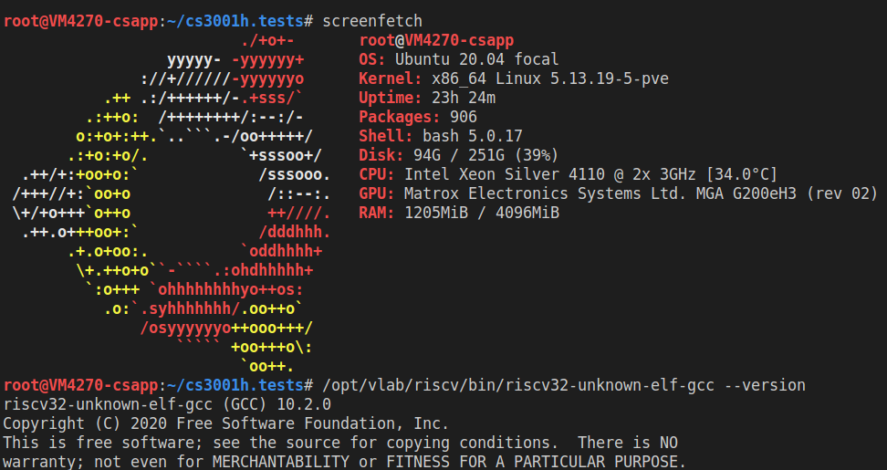

- Vlab Ubuntu 20.04
- riscv32-unknown-elf-gcc 10.2.0

参考修改助教 makefile ，自动生成 objdump 等文件，便于仿真及上板测试

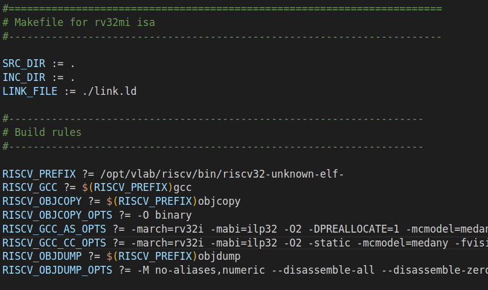

这里需要注意的是，如果编译开启了 `-O2` 优化选项，那么一些对于 MMIO 区域的数据读写操作可能会因为编译器优化而消失，导致 CPU 并未如预期读写这些地址，甚至发生死循环。可以考虑在 C 程序中对 MMIO 地址添加 `volatile` 关键词来禁止编译器的这一优化

### 简介

生命游戏中，对于任意细胞，规则如下：

- 每个细胞有两种状态 - 存活或死亡，每个细胞与以自身为中心的周围 **八格** 细胞产生互动（如图，黑色为存活，白色为死亡）
- 当前细胞为存活状态时，当周围的存活细胞低于 2 个时，该细胞变成死亡状态。（模拟生命数量稀少）
- 当前细胞为存活状态时，当周围有 2 个或 3 个存活细胞时，该细胞保持原样。
- 当前细胞为存活状态时，当周围有超过 3 个存活细胞时，该细胞变成死亡状态。（模拟生命数量过多）
- 当前细胞为死亡状态时，当周围有 3 个存活细胞时，该细胞变成存活状态。（模拟繁殖）

可以把最初的细胞结构定义为种子，当所有在种子中的细胞 **同时** 被以上规则处理后，可以得到第一代细胞图。按规则继续处理当前的细胞图，可以得到下一代的细胞图，周而复始。


### C 语言实现

- 插入 nop 模拟定时

  ```cpp
  for (int i = 0; i < 2000000; i++) {
      asm("addi x0,x0,0");
  }
  ```

- 状态压缩 + 位运算

  ```cpp
  if (life[x] & (1 << y)) {
      state[x] += (cnt == 2 || cnt == 3)? (1 << y) : 0;
  } else {
      state[x] += (cnt == 3)? (1 << y) : 0;
  }
  ```

### VGA 驱动

这里采用的是共享内存的方式，VGA 可以访问主存中的数据从而进行显示器 RGB 信号的映射

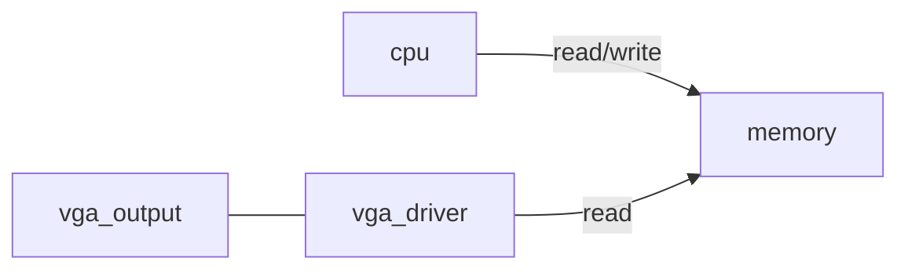

### 展示

稳定的 "脉冲星" 图形（周期为 3）

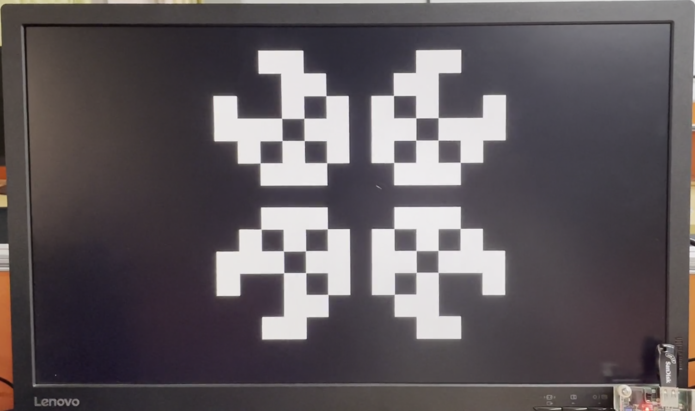

详细视频：<http://home.ustc.edu.cn/~liuly0322/videos/life_game.mp4>

## 井字棋

### C 语言实现

```cpp
#define input_flag 0xff10
#define input_data 0xff14
......
if (!(*((unsigned int*)input_flag))) {
    continue;
}

// 用户输入的值：1-9，表示下在哪个格子
unsigned int user_input = (*((unsigned int*)input_data));

// 判断下的位置是否合法
if (!user_input || user_input > 9 || state[user_input - 1])
    continue;
state[user_input - 1] = turn;
cnt++;

// 首先判断是否胜利，再判断是否占满
if (state[0] == turn && state[1] == turn && state[2] == turn ||
    state[3] == turn && state[4] == turn && state[5] == turn ||
    state[6] == turn && state[7] == turn && state[8] == turn ||
    state[0] == turn && state[3] == turn && state[6] == turn ||
    state[1] == turn && state[4] == turn && state[7] == turn ||
    state[2] == turn && state[5] == turn && state[8] == turn ||
    state[0] == turn && state[4] == turn && state[8] == turn ||
    state[2] == turn && state[4] == turn && state[6] == turn) {
    // 胜利
    state[9] = turn;
} else if (cnt == 9) {
    state[9] = 0;
}

// 圈和叉转换
turn = 3 - turn;
}

// 死循环等待结果输出
while (1)
;
```

从中可以看到交叉编译的方便之处

### 展示

不同的胜负画面：

|  | 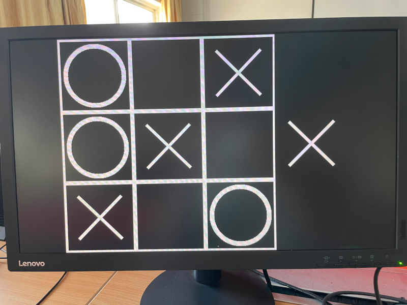 | 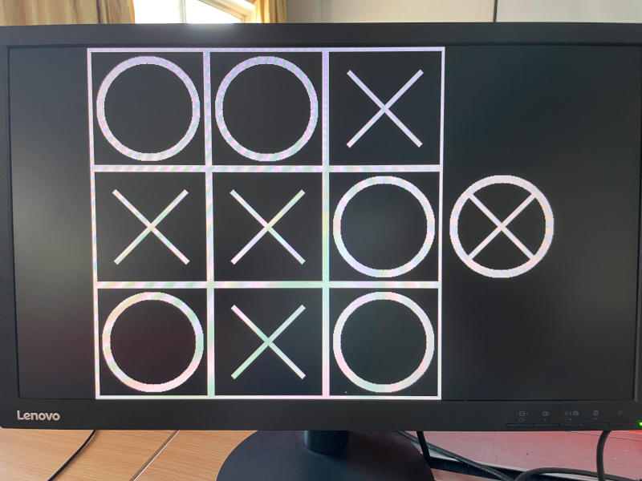 |
| -------------------------- | -------------------------- | ------------------------- |

详细视频：<http://home.ustc.edu.cn/~liuly0322/videos/tic_tac_toe.mp4>

## 贪吃蛇

### 外设使用

贪吃蛇可以比较好的体现出 CPU 处理外部设备的能力

此程序通过 MMIO ，需要访问：

- 性能计数器，起到一个计时器的功能
- 上下左右按钮的输入
- 硬件随机数发生器（可选）

本程序采用初始种子生成苹果坐标，故没有采用硬件随机数生成器；通过轮询的方式，与性能计数器和按钮输入达成了良好的交互

从中也可以看出，中断对于外设交互并不是必须的

> 最初引入硬件中断，只是出于性能上的考量。如果电脑系统没有中断，则处理器与外部设备通信时，它必须在向该设备发出指令后进行忙等待（Busy waiting），反复轮询该设备是否完成了动作并返回结果。这就造成了大量处理器周期被浪费。引入中断以后，当处理器发出设备请求后就可以立即返回以处理其他任务，而当设备完成动作后，发送中断信号给处理器，后者就可以再回过头获取处理结果。这样，在设备进行处理的周期内，处理器可以执行其他一些有意义的工作，而只付出一些很小的切换所引发的时间代价

### C 语言实现

```c
while (1) {
    // 等待计时器
    if ((int)get(CNT_DATA) - past_time < interval) {
        continue;
    }
    past_time += interval;

    // 确认当前方向
    if (get(BTN_VLD))
        direction = get(BTN_DATA);

    // 之前的蛇头变为蛇身
    set(head_x, head_y, BODY_BASE + direction);

    // 计算更新后蛇头坐标
    if (direction == UP) {
        head_x -= 1;
    } else if ......

    // 如果吃到苹果，更新苹果坐标，否则移动蛇尾
    if (head_x == apple_x && head_y == apple_y) {
        set(head_x, head_y, NONE);
        // 随机生成新的坐标
        ......
        set(apple_x, apple_y, APPLE);
    } else {
        int tail_direction =
            ((snake[tail_x][tail_y >> 3] >> (tail_y << 2)) & 15) -
            BODY_BASE;
        set(tail_x, tail_y, NONE);
        // 更新 tail 的位置
        ......
    }

    // 苹果处理完之后，如果当前蛇头所在格子不为空，则说明碰到障碍，退出
    int head_state = (snake[head_x][head_y >> 3] >> (head_y << 2)) & 15;
    if (head_state != NONE)
        break;

    // 设置蛇头，等待下个循环的计算
    set(head_x, head_y, HEAD);
}
```

状态编码采用宏定义配合状态压缩

```c
// 状态压缩，30 行，40 列，8 列压缩为一个 int(32 位)
// 对应每个格子 4bit，参考 00(R分量)0(G分量)0(B分量)
#define NONE 0    // 空格
#define BORDER 1  // 蓝色边框
#define HEAD 2    // 绿色蛇头
#define APPLE 4   // 红色苹果
#define BODY_BASE 7
#define BODY_L 9   // 蛇身，左
#define BODY_R 8   // 蛇身，右
#define BODY_U 15  // 蛇身，上
#define BODY_D 11  // 蛇身，下

// 对应 rv32i 的 lw 指令
inline unsigned get(int p) {
    return *((unsigned*)p);
}

// 输入需要设置的坐标和状态
inline void set(unsigned x, unsigned y, unsigned state) {
    // 先抹平这些位，再将数据移位
    snake[x][y >> 3] &= (~(15 << (y << 2)));
    snake[x][y >> 3] |= (state << (y << 2));
}
```

### 展示

有较好的操作感

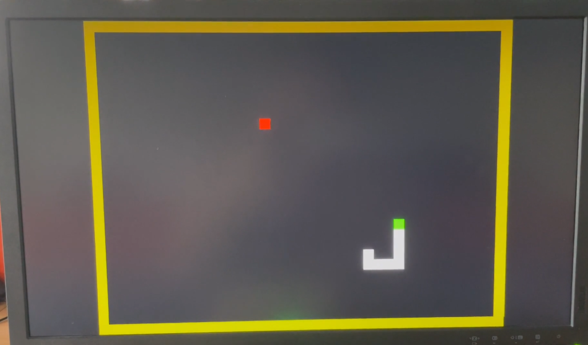

详细视频：<http://home.ustc.edu.cn/~liuly0322/videos/snake.mp4>

## 持续集成

出于项目完整性考虑，使用 Github Actions，增添了自动的持续集成测试

| 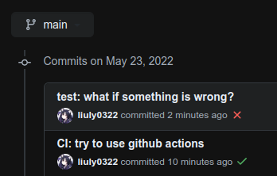 | 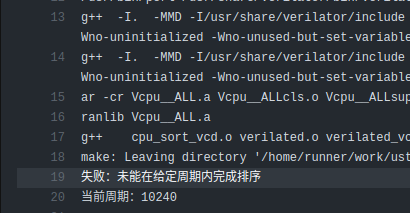 |
| :---------------------------------------: | :--------------------------------------------: |
|            Push 后自动运行测试            |                具体错误信息提示                |

测试脚本和 github actions 的 yml 文件具体参见本项目仓库

## 致谢

- 感谢老师和助教们一个学期以来的辛苦付出
- 本项目得到了中国科学技术大学 Vlab 实验平台的帮助与支持
- 自动化测试参考
  - <https://github.com/cs3001h/cs3001h.tests>
  - <https://github.com/riscv-software-src/riscv-tests>
