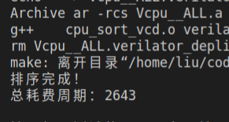
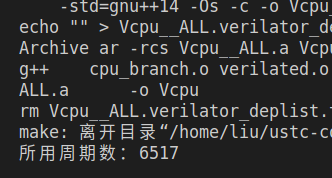
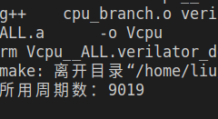
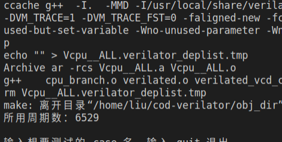

## 指令集相关

已经实现：

- add, sub, and, or, sll, sra, srl, xor, slt, sltu
- addi, andi, ori, slli, srai, srli, xori, slti, sltiu
- auipc, lui
- lw, sw
- beq, bne, blt, bge, bltu, bgeu
- jal, jalr

## 排序测试

### 单周期（CPI = 1）


### 流水线（无分支预测）


$\mathrm{CPI} = 3187/2290 = 1.392$

### 流水线（默认分支失败）


$\mathrm{CPI} = 2819/2290 = 1.231$

### 流水线（ load 仅在产生相关时气泡）



$\mathrm{CPI} = 2643/2290 = 1.154$

### 流水线（分支预测）


$\mathrm{CPI} = 2563/2290 = 1.119$

## 分支测试

```cpp
for (int i = 0; i <= 1000; i++) {
    if (i <= 500) {
        i++;
    }
}
```

对应汇编代码：

```assembly
addi a0, zero, 1000
addi a1, zero, 500
addi t1, zero, 0  # i

LOOP:
blt  a0, t1, FINISH
blt  a1, t1, CONT
addi t1  t1, 1
CONT:
addi t1, t1, 1
beq  zero, zero, LOOP

FINISH:
addi t6, zero, 1
```

### 单周期（CPI = 1）



### 流水线（默认跳转失败分支预测）



$\mathrm{CPI} = 9019/6517=1.384$

### 流水线（优化分支预测）



$\mathrm{CPI}=6529/6517=1.002$

## 分支测试（续）

```c
for (int i = 0; i <= 1000; i++) {
    if (i % 4 == 0) {
        i+= 4;
    }
}
```

汇编：

```assembly
addi a0, zero, 1000
addi t0, zero, 0  # a
addi t1, zero, 0  # i

LOOP:
blt  a0, t1, FINISH
andi t2, t1, 3
bnez t2, CONT
addi t1  t1, 4
CONT:
addi t1, t1, 1
j    LOOP

FINISH:
addi t6, zero, 1
```

### 单周期


### 流水线（饱和计数器）


$\mathrm{CPI} = 1.049$

### 流水线（二级适应性训练）


$\mathrm{CPI} = 1.004$
