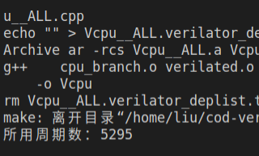

## 指令集扩充

### 新增指令介绍

已经实现：

- add, sub, and, or, sll, sra, srl, xor, slt, sltu
- addi, andi, ori, slli, srai, srli, xori, slti, sltiu
- auipc, lui
- lw, sw
- beq, bne, blt, bge, bltu, bgeu
- jal, jalr

#### 原理介绍

（这里应该可以配个修改后的数据通路图）

- alu 修改（置位指令，lui 指令）
- control 模块控制算数逻辑指令
- 分支跳转部分利用三位标志位

### 新增指令测试

对新增的指令进行了较为充分的测试：

 

测试原理示例：


检测 pass 和 fail 寄存器的值


对应仿真程序：


### Verilator 高级语言仿真

|  |  |
| -------------------------- | -------------------------- |

#### 简介

Verilator 是一款高性能的 Verilog/System Verilog 开源仿真工具。运用 Verilator package，我们可以将 Verilog 和 System Verilog HDL 语言设计编译转换成 C++ 或者 SystemC 模型，所以从这个意义上来说，Verilator 更应该被成为是一个编译器而不是一个传统意义上的仿真器。

   通常情况下，Verilator 的工作流程如下所示：

1. 首先 Verilator 将读取特定的 HDL 文件并检查其代码，同时还可以选择支持检查覆盖率和 debug 波形的生成。然后将源文件编译成源代码级的 `C++`或`SystemC`模型。其输出的模型会以`.cpp`和`.h`文件存在。
2. 为了能够完成仿真，额外需要一个用户自行编写的 C++ wrapper，这个 wrapper 与传统的 Verilog Testbench 功能类似，主要是为了连接顶层模块，并给予相应的激励。
3. 在 C++ 编译器的工作下，所有的之前生成的文件（C++ wrapper 以及 Verilated Model）以及库文件（Verilator 提供的 runtime library 或者 SystemC 库文件）会被一同合并成一个可执行文件。
4. 执行生成的可执行文件，就可以开始实际的仿真，"simulation runtime"

优势：

- 仿真速度更快
- coverage test（覆盖测试）
  - 覆盖率，便于功能验证
  - 断言式的测试样例（灵活度高）

## 分支预测

### 原理

#### 静态分支预测

- 统一不跳转 / 统一跳转
- 下一条指令统一发射地址较小的
- ......

#### 动态分支预测

- 记录上次分支的结果

- 基于两位饱和计数器的分支预测

  

- 两级适应性训练 Two-Level Adaptive Training

  - Tse-Yu Yeh and Yale N. Patt

  

（以下这些测试可以考虑绘制折线图等）

### 排序测试

#### 单周期（CPI = 1）


#### 流水线（无分支预测）


$\mathrm{CPI} = 3187/2290 = 1.392$

#### 流水线（默认分支失败）


$\mathrm{CPI} = 2819/2290 = 1.231$

#### 流水线（ load 仅在产生相关时气泡）


$\mathrm{CPI} = 2643/2290 = 1.154$

#### 流水线（分支预测）


$\mathrm{CPI} = 2563/2290 = 1.119$

### 分支测试

```cpp
for (int i = 0; i <= 1000; i++) {
    if (i <= 500) {
        i++;
    }
}
```

对应汇编代码：

```assembly
addi a0, zero, 1000
addi a1, zero, 500
addi t1, zero, 0  # i

LOOP:
blt  a0, t1, FINISH
blt  a1, t1, CONT
addi t1  t1, 1
CONT:
addi t1, t1, 1
beq  zero, zero, LOOP

FINISH:
addi t6, zero, 1
```

#### 单周期（CPI = 1）


#### 流水线（默认跳转失败分支预测）


$\mathrm{CPI} = 9019/6517=1.384$

#### 流水线（优化分支预测）


$\mathrm{CPI}=6529/6517=1.002$

### 分支测试（续）

```c
for (int i = 0; i <= 1000; i++) {
    if (i % 4 == 0) {
        i+= 4;
    }
}
```

汇编：

```assembly
addi a0, zero, 1000
addi t0, zero, 0  # a
addi t1, zero, 0  # i

LOOP:
blt  a0, t1, FINISH
andi t2, t1, 3
bnez t2, CONT
addi t1  t1, 4
CONT:
addi t1, t1, 1
j    LOOP

FINISH:
addi t6, zero, 1
```

#### 单周期


#### 流水线（饱和计数器）


$\mathrm{CPI} = 1.049$

#### 流水线（二级适应性训练）



$\mathrm{CPI} = 1.004$

## 生命游戏

作为示例，本 cpu 搭载了两个和 vga 结合的展示程序

### 编译

采用 `riscv` 交叉编译工具链，使得仅需要编写 C 程序就可以很方便的烧写上板

环境如下：


- Vlab Ubuntu 20.04
- riscv32-unknown-elf-gcc 10.2.0

配置 makefile 使得自动生成 objdump 等文件


### 简介

生命游戏中，对于任意细胞，规则如下：

- 每个细胞有两种状态 - 存活或死亡，每个细胞与以自身为中心的周围 **八格** 细胞产生互动（如图，黑色为存活，白色为死亡）
- 当前细胞为存活状态时，当周围的存活细胞低于 2 个时，该细胞变成死亡状态。（模拟生命数量稀少）
- 当前细胞为存活状态时，当周围有 2 个或 3 个存活细胞时，该细胞保持原样。
- 当前细胞为存活状态时，当周围有超过 3 个存活细胞时，该细胞变成死亡状态。（模拟生命数量过多）
- 当前细胞为死亡状态时，当周围有 3 个存活细胞时，该细胞变成存活状态。（模拟繁殖）

可以把最初的细胞结构定义为种子，当所有在种子中的细胞 **同时** 被以上规则处理后，可以得到第一代细胞图。按规则继续处理当前的细胞图，可以得到下一代的细胞图，周而复始。


### C 语言实现

- 插入 nop 模拟定时

  ```cpp
  for (int i = 0; i < 2000000; i++) {
      asm("addi x0,x0,0");
  }
  ```

- 状态压缩  + 位运算

  ```cpp
  if (life[x] & (1 << y)) {
      state[x] += (cnt == 2 || cnt == 3)? (1 << y) : 0;
  } else {
      state[x] += (cnt == 3)? (1 << y) : 0;
  }
  ```

### VGA 驱动

这里采用的是共享内存的方式，VGA 可以访问主存中的数据从而进行显示器 RGB 信号的映射


### 展示

<http://home.ustc.edu.cn/~liuly0322/videos/life_game.mp4>

## 井字棋

### C 语言实现

```cpp
#define input_flag 0xff10
#define input_data 0xff14
......
if (!(*((unsigned int*)input_flag))) {
    continue;
}

// 用户输入的值：1-9，表示下在哪个格子
unsigned int user_input = (*((unsigned int*)input_data));

// 判断下的位置是否合法
if (!user_input || user_input > 9 || state[user_input - 1])
    continue;
state[user_input - 1] = turn;
cnt++;

// 首先判断是否胜利，再判断是否占满
if (state[0] == turn && state[1] == turn && state[2] == turn ||
    state[3] == turn && state[4] == turn && state[5] == turn ||
    state[6] == turn && state[7] == turn && state[8] == turn ||
    state[0] == turn && state[3] == turn && state[6] == turn ||
    state[1] == turn && state[4] == turn && state[7] == turn ||
    state[2] == turn && state[5] == turn && state[8] == turn ||
    state[0] == turn && state[4] == turn && state[8] == turn ||
    state[2] == turn && state[4] == turn && state[6] == turn) {
    // 胜利
    state[9] = turn;
} else if (cnt == 9) {
    state[9] = 0;
}

// 圈和叉转换
turn = 3 - turn;
}

// 死循环等待结果输出
while (1)
;
```

从中可以看到交叉编译的方便之处

### 展示

<http://home.ustc.edu.cn/~liuly0322/videos/tic_tac_toe.mp4>

不同的胜负画面：

|  |  |  |
| -------------------------- | --------------------------- | ------------------------- |